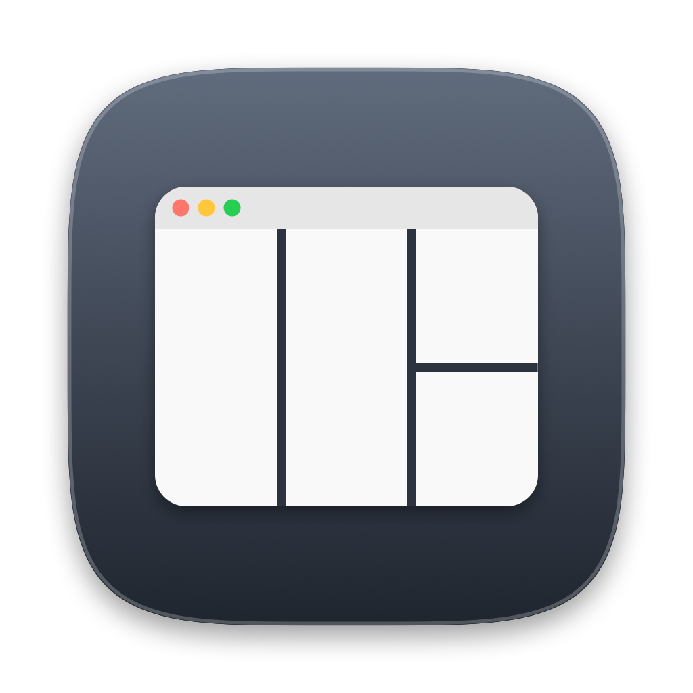

<div align="center">


# TermGrid

**macOS のターミナルを、選んだレイアウトに一発で並べるメニューバーアプリ**

</div>

メニューバーから分割数を選ぶだけで、ターミナルのウィンドウが整列します。
枚数が足りなければ自動で開いて埋めます。

## できること

- 2分割 / 3分割 / 4分割 / 6分割 などをメニューから選ぶだけ
- 足りない分のターミナルを自動で開く
- **配置を元に戻せる**（⌘Z）。並べ直しに失敗しても手で戻す必要がない
- 隙間なくぴったり敷き詰める
- **マウスカーソルのある画面**が対象。外部ディスプレイでもそのまま使える
- メニューバー常駐（Dock には出ない）。ログイン時の自動起動もメニューから設定できる
- コマンドラインからも実行可能（Raycast・ショートカット向け）

| | レイアウト | 枚数 |
| --- | --- | --- |
|  | 2分割（左右） | 2 |
|  | 2分割（上下） | 2 |
|  | 3分割（縦） | 3 |
|  | 4分割（2×2） | 4 |
|  | 6分割（3×2） | 6 |
|  | 左1・中2・右1 | 4 |

同じ絵がメニューの各項目にも並ぶので、名前を読まなくても形で選べます。⌘1〜⌘6 でも選べます。

## メニュー

先頭に**今開いているターミナルの枚数**が出ます。6分割を選んだときに何枚開くことになるか、
選ぶ前に分かります。

- **配置を元に戻す（⌘Z）** … 直前の適用を取り消して元の位置に戻します。1段階のみ。
  新しく開いたウィンドウは閉じません（作業中のセッションを失わないため）
- **今の枚数に合わせて整列** … 開いている枚数にちょうど合うレイアウトを自動で選びます
- **足りないときは新しく開く** … オフにすると、今あるウィンドウだけを並べます

レイアウトの枚数より**多い**ウィンドウがある場合、あぶれた分は動かさずそのまま残します
（勝手に閉じたり最小化したりしません）。

既存ウィンドウは**今の並び順（左→右、上→下）を保ったまま**割り当てられるため、
どのセッションがどこへ動くか入れ替わりません。

## インストール

```sh
git clone https://github.com/ikkei0713-collab/TermGrid.git
cd TermGrid
./build.sh
open ~/Applications/TermGrid.app
```

Xcode は不要です（Command Line Tools の `swiftc` のみ使用）。

初回起動後、最初にレイアウトを選んだ時点で **オートメーションの許可** を求められます。
許可しそこねた場合はアラートの「設定を開く」から該当画面に直接移動できます。

ログイン時の自動起動はメニューの「ログイン時に起動」で切り替えられます。

## コマンドライン

```sh
TG=~/Applications/TermGrid.app/Contents/MacOS/TermGrid

$TG --list        # レイアウト一覧
$TG --apply 4     # 6分割を適用（足りない分は新しく開く）
$TG --tidy 2      # 3分割で整列のみ（新しく開かない）
$TG --dry 4       # 適用せず座標だけ表示
$TG --login on    # ログイン時の自動起動（引数なしで現在の状態を表示）
```

## レイアウトを追加する

`main.swift` 冒頭の `LAYOUTS` に1行足して `./build.sh` を実行するだけです。

```swift
LayoutDef(title: "左3・右1", columns: [3, 1]),
```

`columns` は **各列に何段入れるか**を表します。`[2, 2, 2]` なら3列×2段の6分割、
`[1, 2, 1]` なら左1枚・中央2枚・右1枚。メニューのアイコンもこの定義から自動で描かれます。

ウィンドウ同士を離したい場合は `GAP`（既定 0）を変えてください。

ウルトラワイドなど横に広い画面では、3列だと1枚が広すぎることがあります。
その場合は列を増やしたレイアウトを足すと収まりが良くなります。

```swift
LayoutDef(title: "4分割（縦）",   columns: [1, 1, 1, 1]),
LayoutDef(title: "8分割（4×2）", columns: [2, 2, 2, 2]),
```

配置は画面サイズから毎回計算するため、解像度・アスペクト比・Dock の位置に自動で追従します。
ターミナルの最小ウィンドウサイズは 160×124pt なので、1枚がこれを下回る分割
（例: 幅480pt の画面で3列）だけは指定どおりに並びません。

## 仕組み

- ウィンドウの操作は AppleScript 経由（`bounds` の設定）
- 対象は `visible` かつタブを持つウィンドウのみ。設定ウィンドウなどは巻き込みません
- 配置領域は `NSScreen.visibleFrame`。メニューバーと Dock を自動で避けます
- NSScreen（左下原点）と AppleScript（左上原点）の座標系の差はアプリ側で吸収しています

## アイコンについて

`makeicon.swift` が CoreGraphics で全サイズを描画します。画像ファイルは同梱していません。

- 角丸は円弧ではなく superellipse（`|x|^n + |y|^n = 1`, n=4.6）
- 16px / 32px は縮小すると溝が潰れるため、溝の太さや要素の有無を変えて個別に描画

## 必要環境

macOS 13 以降 / Xcode Command Line Tools

## ライセンス

MIT
